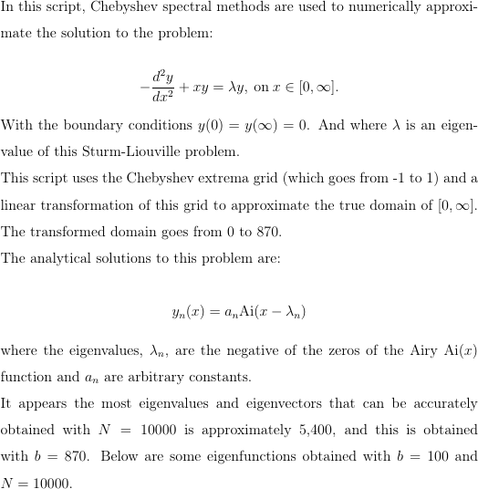

# Sturm-Liouville problem solvers

## [SLEq_with_fixes.py](SLEq_with_fixes.py)

| #  | Eigenvalue | Plot                                          |
|----|------------|-----------------------------------------------|
| 1  | 2.33810741 |    |
| 2  | 4.08794944 |    |
| 3  | 5.52055983 |    |
| 4  | 6.78670809 |    |
| 5  | 7.94413359 |    |
| 6  | 9.02265085 |    |
| 7  | 10.0401743 |    |
| 8  | 11.0085243 |    |
| 9  | 11.9360156 |    |
| 10 | 12.8287768 |  |
| 11 | 13.6914890 |  |
| 12 | 14.5278300 |  |

**Plots generated by SLEq_with_fixes.py as of commit [a58cd24dc2ec975234a9714ead68d06a57856e0d](https://github.com/fusion809/python-scripts/blob/a58cd24dc2ec975234a9714ead68d06a57856e0d/SLE/SLEq_with_fixes.py) (number 99)**

| Fig # | Eigenvalue | Plot                              |
|-------|------------|-----------------------------------|
| 1     | 2.33810741 |  |
| 2     | 4.08794944 |  |
| 3     | 5.52055983 |  |
| 4     | 6.78670809 |    |
| 5     | 7.94413359 |    |
| 6     | 9.02265085 |    |
| 7     | 10.0401743 |    |
| 8     | 11.0085243 |    |
| 9     | 11.9360156 |    |
| 10    | 12.8287768 |  |
| 11    | 13.6914890 |  |
| 12    | 14.5278300 |  |
| 13  5361st eig | 860.949723 |  |
| 14    | N/A Semilog plot of the error in eigenvalues |  |
| 14    | N/A Semilog plot of the error in eigenvalues |  |
| 15    | N/A Semilog plot of the root mean square error in eigenvectors |  |