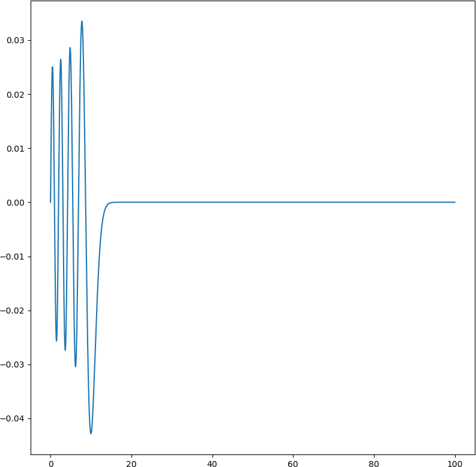

# Sturm-Louiville problem solvers

## [SLEq_with_fixes.py](SLEq_with_fixes.py)

| #  | Eigenvalue | Plot                                          |
|----|------------|-----------------------------------------------|
| 1  | 2.33810741 |    |
| 2  | 4.08794944 |    |
| 3  | 5.52055983 |    |
| 4  | 6.78670809 |    |
| 5  | 7.94413359 |    |
| 6  | 9.02265085 |    |
| 7  | 10.0401743 |    |
| 8  | 11.0085243 |    |
| 9  | 11.9360156 |    |
| 10 | 12.8287768 |  |
| 11 | 13.6914890 |  |
| 12 | 14.5278300 |  |